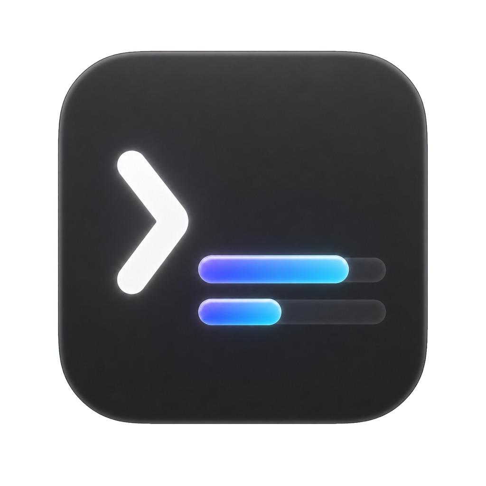

# Codex Quota

> A compact macOS quota companion for Codex.

Codex Quota 是一个原生 macOS 后台小工具：Codex 运行时显示额度气泡，Codex 退出后自动隐藏。默认展示 5 小时剩余额度，悬停后展开周额度与重置时间。

<p align="center">
  
</p>

## 功能

- 原生 Swift、SwiftUI 与 AppKit 实现，无 Electron 运行时。
- 显示 5 小时和周额度；5 小时窗口不可用时自动回退到周额度。
- 可拖动悬浮窗并记忆位置，悬停平滑展开。
- Codex 启动时显示，退出时隐藏；不抢占当前应用焦点。
- 安装到 `/Applications` 或 `~/Applications` 后，首次启动会自动尝试注册为 macOS 登录项。
- 不修改 Codex，不读取认证文件，不复制访问令牌。

## 系统要求

- macOS 26 或更高版本。
- 当前实机验证范围为 Apple silicon Mac。
- 已安装官方 Codex 桌面应用，当前兼容路径为 `/Applications/ChatGPT.app`，bundle identifier 为 `com.openai.codex`。

Codex 的内部 `app-server` 协议可能随版本变化；如果升级 Codex 后额度不可用，请提交 Issue 并附上 Codex 版本号，不要附带账户或认证信息。

## 从源码构建

需要 Xcode Command Line Tools、Swift 6.2 和 Node.js 22 或更高版本。

```bash
git clone https://github.com/MrPPFruit/Codex-Quota.git
cd Codex-Quota
swift test
npm test
npm run build:accessory
```

应用会生成在：

```text
artifacts/build/Codex Quota.app
```

本地构建使用 ad-hoc 签名，仅适用于开发和自行构建。将应用复制到 `/Applications` 后启动，登录项注册功能才会启用。

## 发布状态

`v0.1.1-preview.1` 提供 Apple silicon 的未公证预览 ZIP。它使用 ad-hoc 签名，不具备 Developer ID 身份，也没有经过 Apple 公证；macOS 会在首次运行时阻止它。这个包只适合了解风险并信任本仓库源码与 Release 校验值的测试用户，不等同于正式可信分发。SHA-256 只能校验下载内容是否与 Release 资产一致，不能替代开发者身份认证。

首次打开时：

1. 将 `Codex Quota.app` 移到 `/Applications`。
2. 尝试打开一次，等待 macOS 显示安全警告。
3. 打开“系统设置 → 隐私与安全性”，在安全性区域选择“仍要打开”。
4. 核对系统再次显示的应用名称后确认打开。

不要关闭 Gatekeeper，也不要执行全局移除隔离属性的命令。Developer ID 到位后，项目会改为 Hardened Runtime 签名和 Apple 公证的正式 ZIP 或 DMG。

受企业管理策略约束的 Mac 可能没有“仍要打开”入口。预览版没有自动更新器；升级时请退出应用、替换 `/Applications` 中的旧版本并重新打开。由于每次 ad-hoc 构建的身份可能变化，新版本可能需要再次执行“仍要打开”；若登录项失效，可在应用菜单中关闭后重新启用“登录时启动”。

风险、校验和未来正式二进制发布步骤见 [macOS 分发说明](docs/macos-distribution.md)。

## 隐私与权限

- 不要求辅助功能、录屏或“访问其他 App 数据”权限。
- 不提供网络服务，不收集遥测。
- 额度数据只保存在内存中；应用退出后不会保存历史额度。
- 登录项由 macOS `SMAppService` 管理。首次稳定安装启动时会自动尝试注册；可在应用菜单或“系统设置 → 通用 → 登录项”中关闭，关闭后应用不会擅自重新启用。

## 已知限制

- 公开窗口信息无法可靠识别 Codex 小宠物，因此当前只提供独立悬浮窗，不强行吸附到宠物旁。
- 多显示器布局已有自动化测试，但首版尚未完成多屏 Mac 实机验收。
- 当前未验证 Intel Mac。
- 首个公开版本的 bundle identifier 为 `com.ppfruit.codex-quota`；后续版本会保持这一身份不变，以维持登录项和本地偏好的连续性。

## 许可证与声明

本项目使用 [MIT License](LICENSE)。Codex Quota 是独立的社区项目，与 OpenAI 无隶属或官方背书关系。Codex 与相关标识归其权利人所有。
